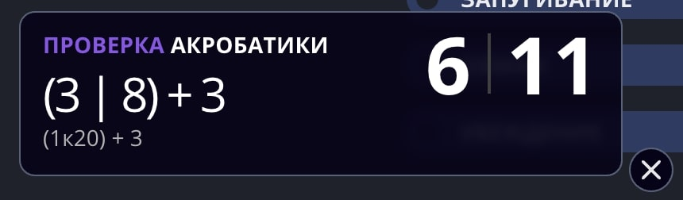
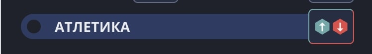
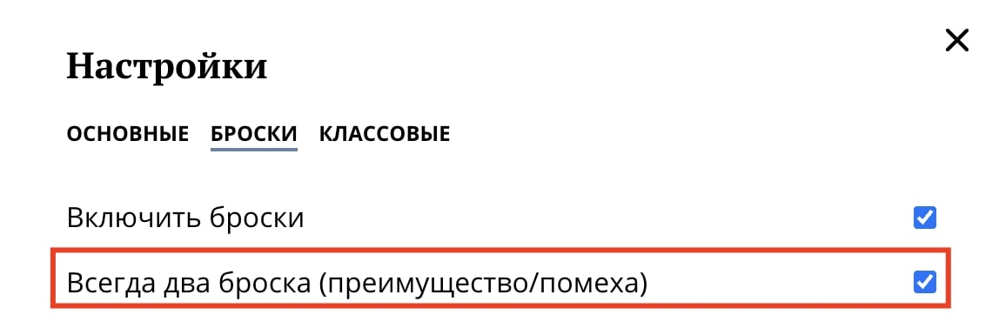

:::caution[Устаревший механизм]
Этот механизм бросков с преимуществом устарел и не работает. Мы уже трудимся над тем, чтобы вернуть бросок с преимуществом или помехой и сделать его как никогда удобным.
:::

Совершая любую проверку, вы можете бросить сразу 2d20, а затем самостоятельно выбрать большее и меньшее значение в зависимости от того, была ли она с преимуществом или помехой.

Для этого **на компьютере** необходимо зажать Shift и затем кликнуть на нужную проверку.

На **мобильных устройствах** то же самое возможно по долгому нажатию. При этом кнопка броска поменяется на иконку «преимущество/помеха»:

Данный функционал доступен для проверок:
- **навыков**
- **характеристик**
- **спасбросков**
- **инициативы**
- **атаки**

## Всегда два броска

В настройках классического листа персонажа вы можете включить постоянный двойной бросок.

В таком случае при любой проверке из перечисленных выше всегда будет происходить два броска. Для обычных проверок всегда смотрите на первое выпавшее значение, а для проверок с преимуществом/помехой на большее/меньшее.
