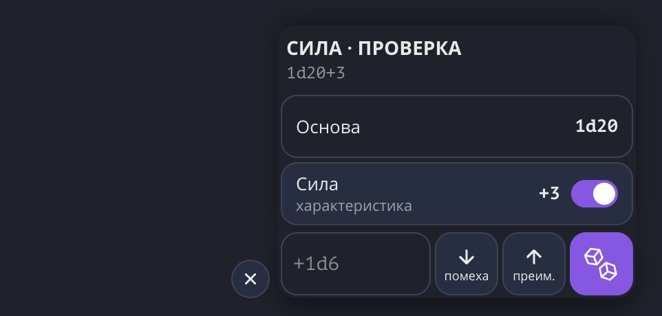

Обычный клик по проверке, атаке или урону — сразу бросок со всеми бонусами. Если бросок нужно
поправить, откройте его в **заряженной дайснице**:

*   **на компьютере** — Shift-клик по броску (или Shift+Enter, если он выбран с клавиатуры);
*   **на телефоне** — удержание пальцем.

## Что можно сделать

*   **Бросить с преимуществом или помехой** — кнопки рядом с «Бросить». Бросаются две d20, в итог идёт
    большая или меньшая, сброшенная в логе приглушена. Кнопок нет у бросков без d20 — например, у урона.
*   **Снять часть броска.** Бросок разложен на части: основа (`1d20` или кости урона), характеристика,
    мастерство, бонусы листа с подписью, откуда они. Любую часть, кроме основы, можно выключить
    тумблером — например, Благословение, если его действие кончилось.
*   **Докинуть** — прибавить к броску формулу: `+1d6`, `-2`, `+[PROF]`. Правила записи — в
    [нотации формул](/doc/character-sheet/notation/).
*   **Критическое попадание** — у урона: кости урона удваиваются, числа нет.

Esc или клик мимо дайсницы — отмена без броска. Пока заряженная дайсница открыта, остальные проверки
бросаются обычным кликом.

Поддерживаются проверки **навыков**, **характеристик**, **спасбросков**, **инициативы**,
**атаки** оружием и заклинанием, **урон** оружия, **каст заклинания**, а также формулы в
[текстовом редакторе](/doc/text-editor/dice-roller/) — у них из частей только основа и «докинуть».

## Каст заклинания

Shift-клик или удержание по кнопке каста — или по ячейке, если заклинание предлагает выбрать,
чем платить, — открывает каст в заряженной дайснице по очереди: сначала атака, затем урон
каждой части. Ячейка тратится, а каст уходит в комнату, когда брошено всё. Отмена на первом
броске — каста нет, ячейка цела.

Натуральная 20 на атаке заклинанием удваивает кости урона: при обычном касте сама, в заряженной
дайснице урон откроется с уже включённым «Критическим попаданием».

## Пустая дайсница

Кнопка с d20 в углу экрана открывает дайсницу для бросков, которых на листе нет: выберите кости
и модификатор или напишите формулу. Формула с ошибкой не бросается — причина появится над полем.
