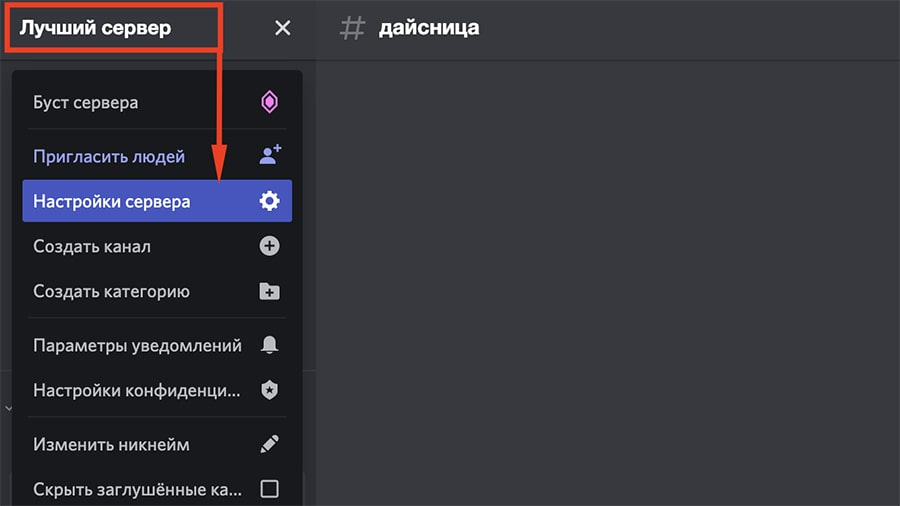
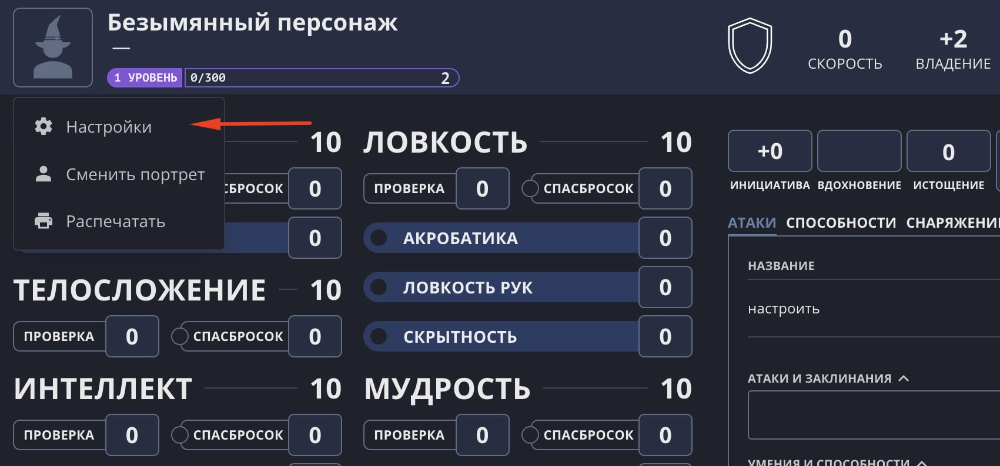
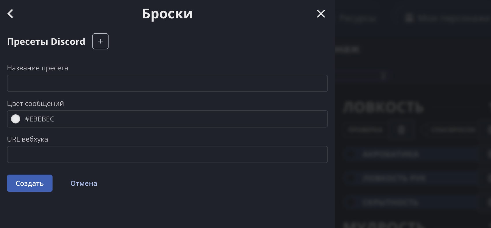
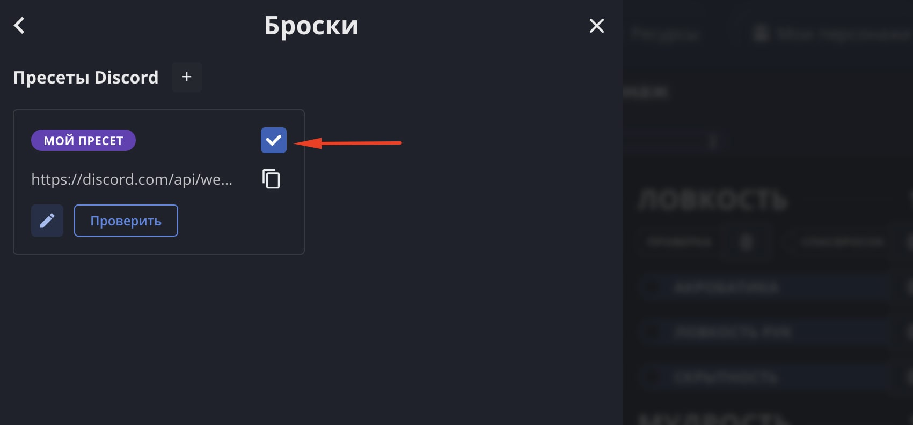

:::caution[Устаревший механизм]
Этот механизм отправки бросков в мессенджеры устарел и вскоре будет отключён. Используйте вместо него [комнаты Vortex](/doc/vortex/about/).
:::

Наш лист персонажа умеет передавать броски и скастованные заклинания в Discord и [Telegram](/doc/character-sheet/telegram/). Это удобно, если вы играете онлайн и хотите, чтобы все игроки находились в едином контексте.

## 1. Настройте Discord

Эти действия нужно совершить кому-то одному, у кого есть право настраивать Discord-сервер.

### 1.1 Сервер Discord

Создайте сервер в Discord, если у вас его ещё нет, и зайдите в его настройки.

### 1.2 Создайте вебхук

В разделе «Интеграция» создайте вебхук. Выберите канал, в который хотите отправлять броски, задайте имя и аватарку боту, который будет присылать броски в чат.

### 1.3 Получите URL вебхука

Скопируйте URL вебхука. Он будет иметь такой вид:

`https://discord.com/api/webhooks/1045914834599747689/pUxaLhP8AOw-4x_FIPFmohWmG1F7X1dwq24OPvccsSSdvcy11bHur0CHcQlmDqOgTKl5`

Скиньте скопированный URL остальным игрокам, он будет **общим для всех**.

## 2. Настройте лист персонажа

Эти действия нужно совершить всем, кто хочет отправлять свои броски из листа в Discord.

### 2.1 Зайдите в настройки бросков

Откройте свой лист персонажа, нажмите на аватарку и зайдите в Настройки > Настройки бросков.

Здесь можно создать пресет. Список пресетов будет общим для всех ваших персонажей.

### 2.2 Создайте пресет Discord

Нажмите на + и в появившейся форме выберите тип пресета «Discord». Заполните все поля.

**Название пресета** — будет отображаться только в этих настройках.

**Цвет сообщений** — цвет, которым будут отмечаться ваши сообщения в Discord. Вы можете выбрать из предложенных вариантов или вписать собственный в формате hex.

**URL вебхука** — ссылка, полученная в 1.3 пункте при настройке сервера в Discord.

### 2.3 Проверьте пресет

У созданного пресета имеется кнопка «Проверить», с помощью которой можно отправить тестовое сообщение в Discord. Если сообщение не отправилось, проверьте правильность указанного URL вебхука.

### 2.4 Активируйте пресет

Чтобы привязать пресет к персонажу, поставьте галочку в правом верхнем углу пресета.

