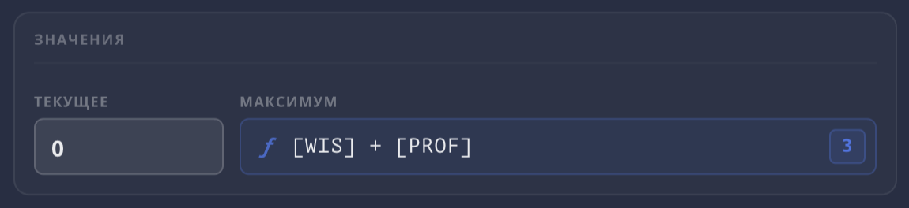

Некоторые поля листа персонажа принимают не только числа, но и формулы — например, бонус к навыку или урон оружия. Такие поля имеют синий цвет и помечены иконкой **ƒ**.



Если формула содержит переменные или функции, справа появляется подсказка с вычисленным значением.

## Переменные

Переменные ссылаются на текущие характеристики персонажа. Имя переменной нужно заключать в **квадратные скобки**:

| Переменная | Значение |
| --- | --- |
| `[STR]` | Модификатор Силы |
| `[DEX]` | Модификатор Ловкости |
| `[CON]` | Модификатор Телосложения |
| `[INT]` | Модификатор Интеллекта |
| `[WIS]` | Модификатор Мудрости |
| `[CHA]` | Модификатор Харизмы |
| `[PROF]` | Бонус мастерства |
| `[LVL]` | Уровень персонажа |

## Арифметика

Стандартные арифметические операции:

| Оператор | Действие | Пример |
| --- | --- | --- |
| `+` | Сложение | `[WIS]+2` |
| `-` | Вычитание | `[STR]-1` |
| `*` | Умножение | `[PROF]*2` |
| `/` | Деление | `[LVL]/2` |
| `^` | Степень | `2^[LVL]` |

## Функции

Стандартные математические функции:

| Функция | Действие | Пример |
| --- | --- | --- |
| `floor(x)` | Округление вниз | `floor([LVL]/2)` |
| `ceil(x)` | Округление вверх | `ceil([PROF]/3)` |
| `round(x)` | Округление | `round([STR]/2)` |
| `abs(x)` | Модуль числа | `abs([STR])` |
| `max(a, b)` | Максимум | `max([STR],[CON])` |
| `min(a, b)` | Минимум | `min([LVL], 5)` |

## Примеры

```
[WIS]+2                 — Мудрость + 2
[PROF]*2                — Удвоенный бонус мастерства
[STR]+[CON]             — Сумма двух модификаторов
floor([LVL]/2)+[PROF]   — Половина уровня плюс мастерство
2d6+[STR]               — Урон: 2d6 плюс Сила
```

---

Подробнее о системе бонусов — в статье [Система бонусов](/doc/character-sheet/bonuses/).
