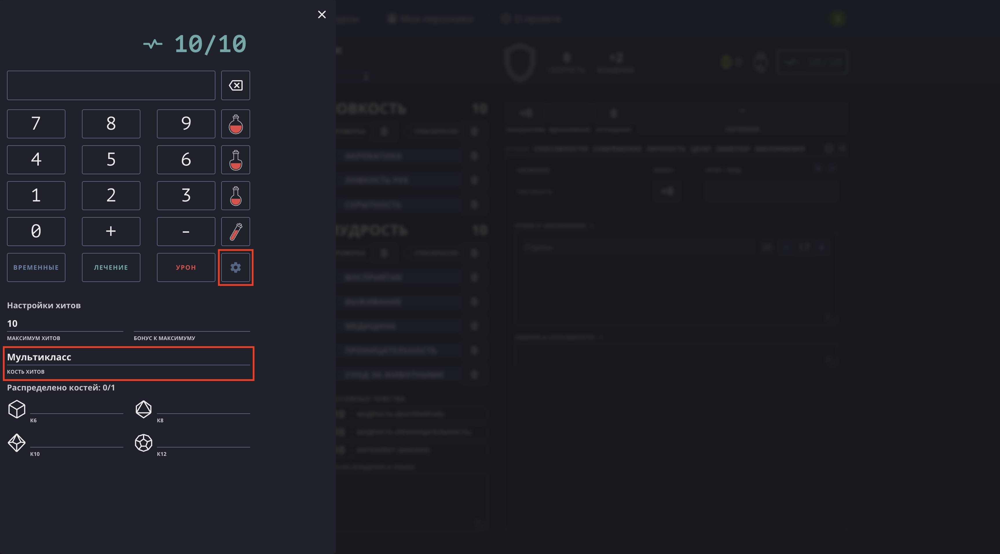
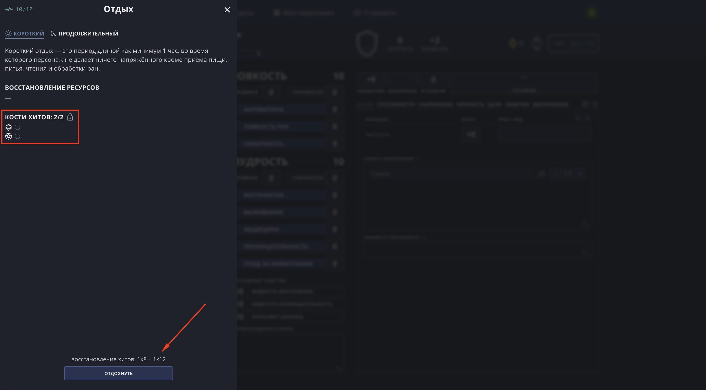
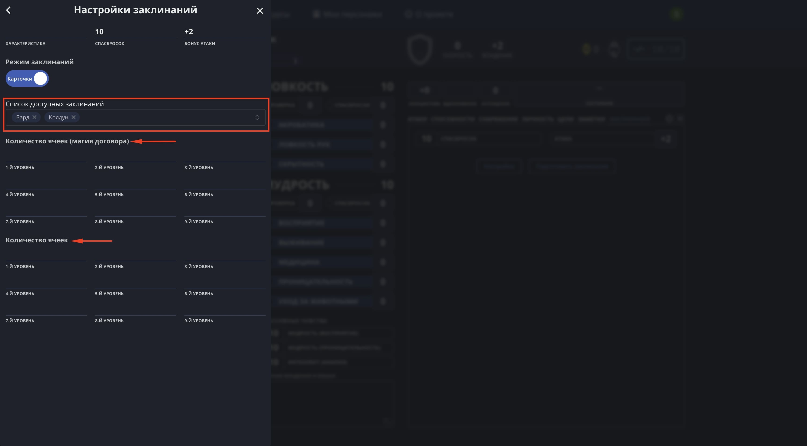
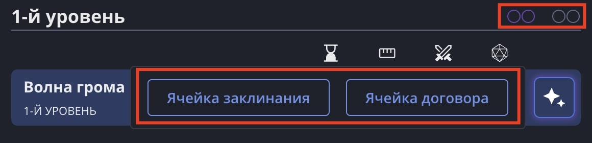

## Кости хитов

Зайдите в калькулятор здоровья и нажмите кнопку настроек. Далее вы сможете выбрать тип кости хитов, в том числе «Мультикласс». В таком режиме вы можете распределить все доступные кости (общее количество равно уровню персонажа).

Это затем позволит тратить разные кости хитов во время короткого отдыха:

## Ячейки заклинаний и договора

Если в поле доступных заклинаний одновременно выбрать колдуна и любой другой заклинательный класс, появится два набора разных ячеек для их раздельного отслеживания.

При этом оба типа ячеек будут отображаться в списке заклинаний, а при попытке сотворить заклинание вам будет предложен выбор между обычными ячейками и ячейками договора колдуна.

