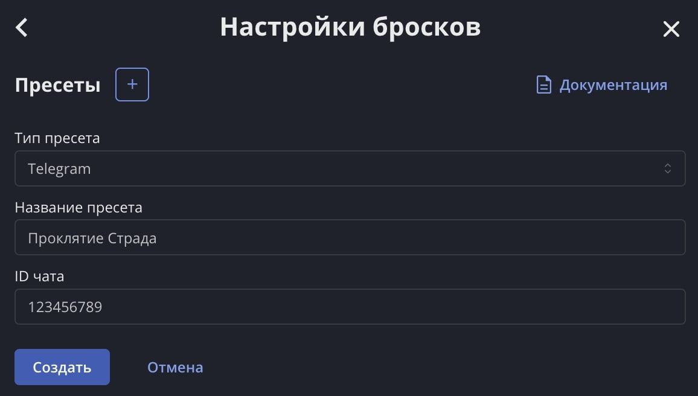
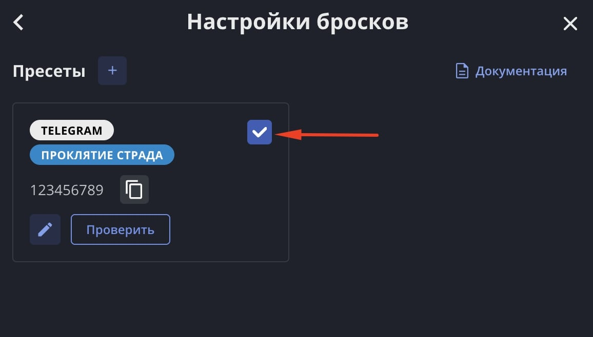

:::caution[Устаревший механизм]
Этот механизм отправки бросков в мессенджеры устарел и вскоре будет отключён. Используйте вместо него [комнаты Vortex](/doc/vortex/about/).
:::

Наш лист персонажа умеет передавать броски и скастованные заклинания в Telegram и [Discord](/doc/character-sheet/discord/). Это удобно, если вы играете онлайн и хотите, чтобы все игроки находились в едином контексте.

## 1. Настройте Telegram

Эти действия нужно совершить кому-то одному, у кого есть право приглашать в Telegram-группу.

### 1.1 Бот в Telegram

Создайте группу в Telegram, если у вас её ещё нет, и добавьте в неё нашего бота `@lss_app_bot`.

### 1.2 Получите ID чата

Отправьте в группу команду `/start`, и бот в ответ подскажет ID вашего чата. Нажмите на него, чтобы скопировать.

## 2. Настройте лист персонажа

Эти действия нужно совершить всем, кто хочет отправлять свои броски из листа в Telegram.

### 2.1 Зайдите в настройки бросков

Откройте свой лист персонажа, нажмите на аватарку и зайдите в Настройки > Настройки бросков.

Здесь можно создать пресет. Список пресетов будет общим для всех ваших персонажей.

### 2.2 Создайте пресет Telegram

Нажмите на + и в появившейся форме выберите тип пресета «Telegram». Заполните все поля.

**Название пресета** — будет отображаться только в этих настройках.

**ID чата** — идентификатор, полученный от бота в 1.2 пункте.

### 2.3 Проверьте пресет

У созданного пресета имеется кнопка «Проверить», с помощью которой можно отправить тестовое сообщение в Telegram.

Если сообщение не отправляется, проверьте правильность указанного ID чата и права бота в вашей группе.

### 2.4 Активируйте пресет

Чтобы привязать пресет к персонажу, поставьте галочку в правом верхнем углу пресета.

