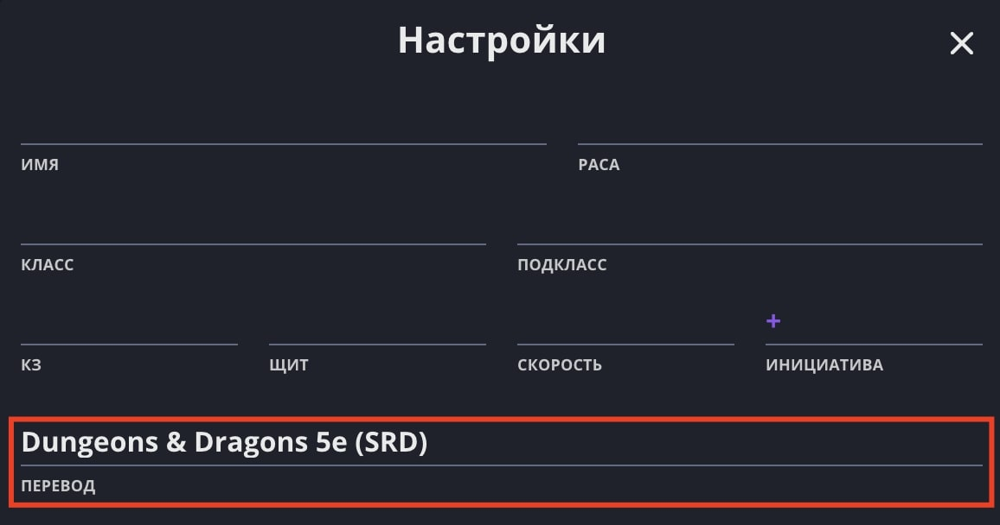

Лист персонажа Long Story Short поддерживает переключение перевода через настройки:

В данный момент доступны следующие переводы:

- **SRD**: перевод по умолчанию, выполненный проектом «Киборги и Чародеи».
- **Hobby World**: официальный перевод D&D 5e в России.
- **PHantom**: фанатский перевод D&D 5e от студии «PHantom». Первый и наиболее популярный.
- **D&D_ru**: фанатский перевод D&D 5e от команды dungeonsanddragons_ru. Популярный и выверенный.
- **BY**: фанатский перевод D&D 5e на белорусский язык. Выполнен нами и неравнодушными жителями нашего Discord-сервера.
- **UA**: фанатский перевод D&D 5e на украинский язык. Выполнен нами и неравнодушными жителями нашего Discord-сервера.
- **EN**: оригинальный английский текст D&D 5e.

Также, через поле «Перевод» можно включить лист персонажа для «[Приключений в Средиземье](/doc/misc/aime/)».
