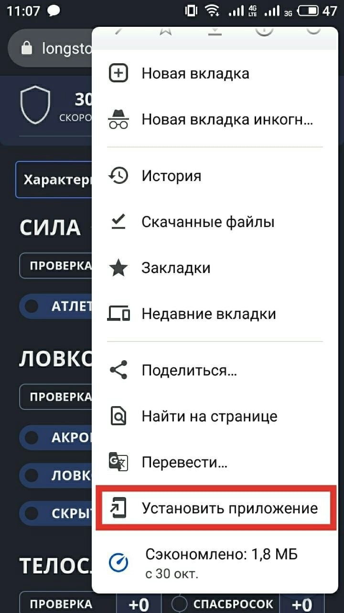
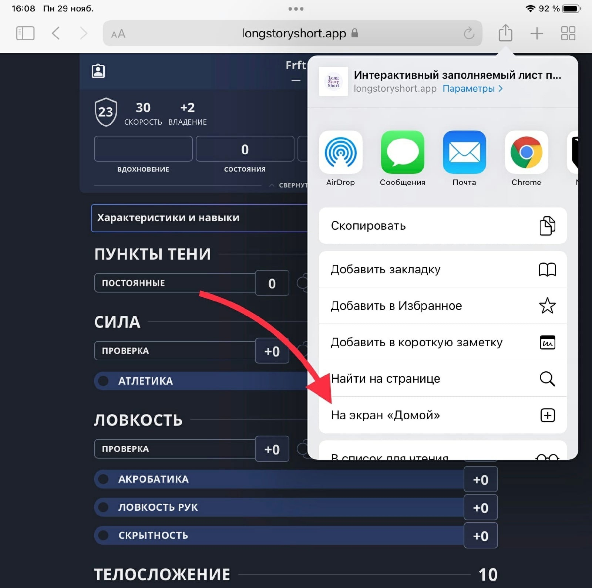

Вы можете установить приложение Long Story Short для быстрого доступа к сайту с домашнего экрана мобильного устройства и даже рабочего стола компьютера.

import InstallButton from '../../src/components/InstallButton.astro';

Наиболее простой способ — нажать на кнопку ниже:

<InstallButton />

Кнопки нет? Значит, браузер не предлагает установку — например, приложение уже
установлено или вы используете Safari. Тогда можно установить в ручном режиме.

## Установка на Android

1. Зайдите на сайт через браузер Google Chrome.
2. Откройте браузерное меню и найдите кнопку «Установить приложение».

Некоторые другие браузеры тоже умеют устанавливать сайты подобным образом, в них эта функция может называться иначе, например, «Добавить на главный экран».

## Установка на iOS

1. Зайдите на сайт через браузер Safari.
2. Откройте браузерное меню и найдите кнопку «На экран „Домой“».

