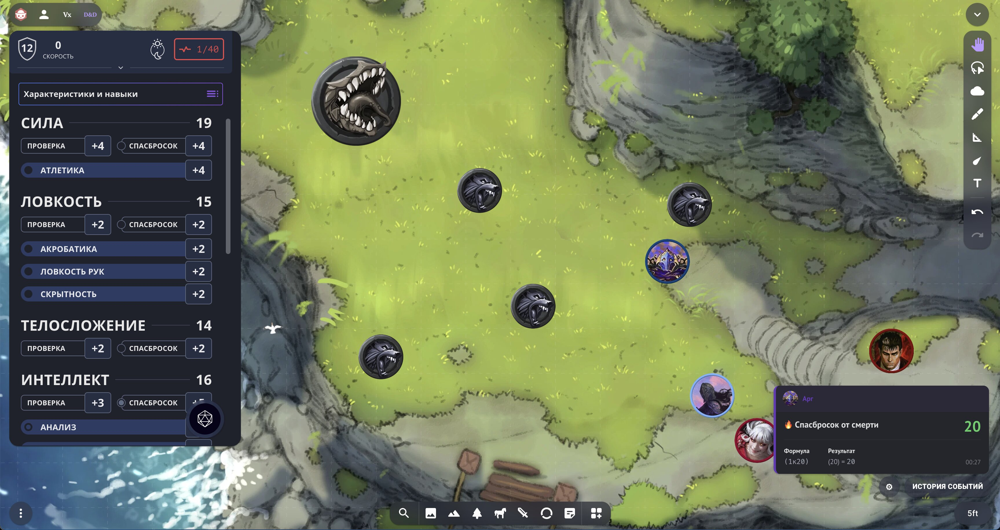
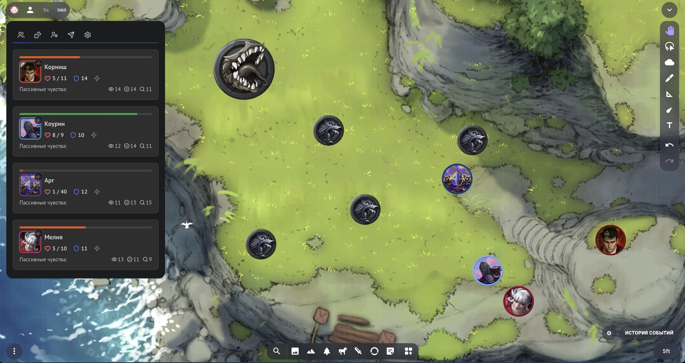
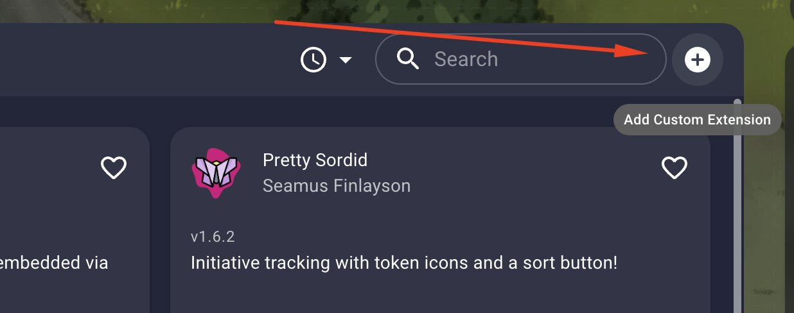
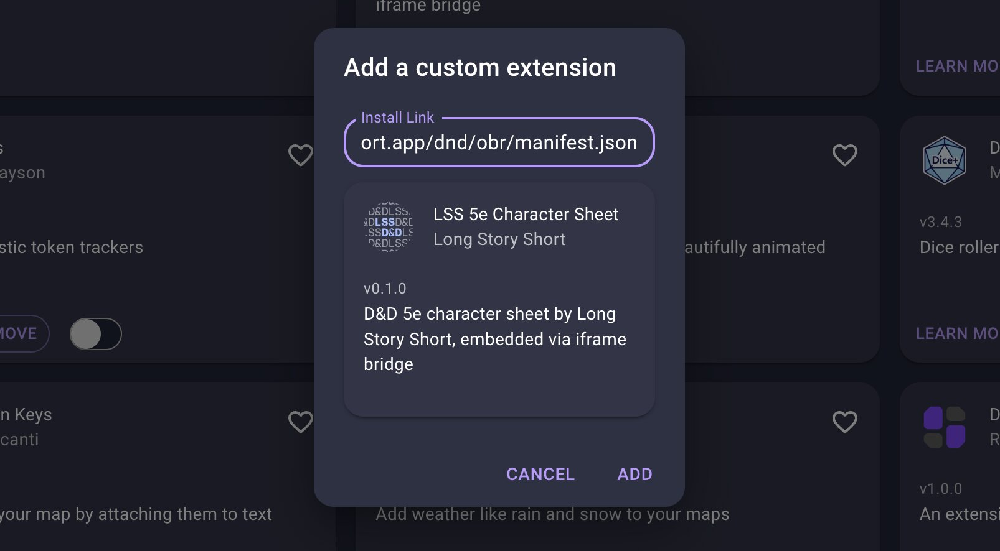
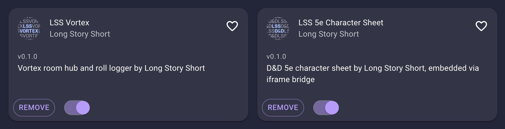

[Owlbear Rodeo](https://www.owlbear.rodeo/) — это виртуальный игровой стол: карты, токены, туман войны и всё, что нужно для онлайн-игры. С помощью наших расширений вы можете дать Owlbear Rodeo суперспособности, добавив в него полноценные листы персонажей Long Story Short и панель управления игрой с общим логом бросков [Vortex](/doc/vortex/about/). Всё это без необходимости переключаться между вкладками.

Расширения бесплатны и подключаются по ссылке за пару минут.



Ссылки на манифесты (если не знаете, что с ними делать, читайте ниже раздел «Установка расширений»).

**Лист персонажа D&D 5e:**
```
https://bridge.longstoryshort.app/dnd/obr/manifest.json
```

**Комнаты Vortex:**
```
https://bridge.longstoryshort.app/vortex/obr/manifest.json
```

## Что даёт интеграция

Есть два отдельных расширения. Можно поставить только одно или оба сразу — они дополняют друг друга, но не зависят одно от другого.

### Лист персонажа D&D 5e

Открывает ваш [интерактивный лист персонажа](https://longstoryshort.app/characters/list/) в боковой панели прямо поверх стола. Вы получаете:

- **Полноценный лист персонажа**, не покидая Owlbear Rodeo — характеристики, броски, заклинания, инвентарь.
- **Броски на столе.** Когда вы бросаете кости с листа, результат показывается всплывающим уведомлением в Owlbear Rodeo.
- **Общий контекст.** Ваши броски автоматически рассылаются остальным игрокам в комнате — они видят их у себя таким же уведомлением. Все в курсе, кто что бросил, без копирования в чат.

### Комнаты Vortex

Подключает к столу [комнату Vortex](/doc/vortex/about/) — центр управления игровой сессией. Внутри Owlbear Rodeo вы увидите:

- **Карточки всей группы** в реальном времени: здоровье, доспех, ключевые характеристики подключённых персонажей.
- **Живой лог бросков** — компактная панель, в которой мгновенно появляются все броски и сотворённые заклинания участников комнаты.



Если оба расширения установлены и комната Vortex подключена, броски с листа автоматически попадают в общий лог Vortex. В этом случае обычные всплывающие уведомления от листа отключаются, чтобы один и тот же бросок не показывался дважды — всё видно в логе.


## Что понадобится

- Аккаунт в [Owlbear Rodeo](https://www.owlbear.rodeo/) (подойдёт бесплатный).
- Аккаунт в [Long Story Short](https://longstoryshort.app/) хотя бы с одним персонажем.
- Для комнат — созданная комната [Vortex](/doc/vortex/adding-characters/) и её код.

## Установка расширений

Расширения подключаются по ссылке на **манифест** — это короткий файл, по которому Owlbear Rodeo понимает, что и откуда загружать. Вам нужно просто скопировать ссылку и вставить её в нужное поле.

Вот ссылки на манифесты:

**Лист персонажа D&D 5e:**
```
https://bridge.longstoryshort.app/dnd/obr/manifest.json
```

**Комнаты Vortex:**
```
https://bridge.longstoryshort.app/vortex/obr/manifest.json
```

> Каждое расширение добавляется отдельно. Если хотите оба — повторите шаги установки для каждой ссылки.

### Шаг 1. Войдите в Owlbear Rodeo

Откройте [owlbear.rodeo](https://www.owlbear.rodeo/) и войдите в свой аккаунт.

### Шаг 2. Откройте раздел расширений

Перейдите в свой профиль и найдите раздел с расширениями (**Extensions**). Там же есть кнопка для добавления нового расширения — **Add Custom Extension**.



### Шаг 3. Добавьте расширение по ссылке

В открывшемся окне вы увидите текстовое поле **Install Link**. Вставьте туда одну из ссылок выше и подтвердите установку.



После установки расширение появится в списке ваших расширений. Если хотите подключить и лист персонажа, и Vortex — повторите шаг с другой ссылкой.

**Важно**: после добавления расширения не забудьте включить его, активировав тумблер.



### Шаг 4. Откройте расширение в комнате

Зайдите в свою комнату Owlbear Rodeo (или создайте новую). Значок установленного расширения появится среди элементов управления столом. Нажмите на него, чтобы открыть панель — лист персонажа или Vortex.

> Расширение привязывается к вашему аккаунту Owlbear Rodeo. Чтобы лист персонажа был у каждого игрока, установить расширение нужно каждому, кто хочет им пользоваться.

## Как пользоваться

### Лист персонажа

1. Откройте панель листа персонажа по значку расширения.
2. При подключении появится уведомление о том, что лист подключён к столу.
3. Войдите в свой аккаунт Long Story Short (если ещё не вошли) и выберите персонажа.
4. Бросайте кости прямо с листа — результат увидите вы и все игроки в комнате.

### Комнаты Vortex

1. Откройте панель Vortex по значку расширения.
2. Выберите комнату из списка (как создать комнату и подключить персонажей — в [инструкции по Vortex](/doc/vortex/adding-characters/)).
3. После подключения в панели появятся карточки группы, а в правом нижнем углу стола — живой лог бросков.
4. Все броски участников комнаты будут попадать в этот лог автоматически.

Обычно Vortex держит открытым мастер, чтобы видеть общую картину сессии, но открыть его может любой участник комнаты.

## Возможные проблемы

- **Не вижу значок расширения в комнате.** Убедитесь, что вошли в тот же аккаунт Owlbear Rodeo, на который устанавливали расширение, что установка завершилась без ошибок, и что вы включили расширение, переключив тумблер на его карточке. Попробуйте перезагрузить страницу комнаты.
- **Лист просит войти каждый раз.** Это нормально для встроенного окна, у разных браузеров может быть своя политика сохранения токена авторизации. Обычно он живёт около месяца.
- **Броски не видны другим игрокам.** Проверьте, что вы находитесь в одной комнате Owlbear Rodeo, а персонажи добавлены в одну и ту же комнату Vortex. Также убедитесь, что у всех участников установлено и активировано расширение Vortex.
- **Действия из Vortex не отражаются в листе.** Через комнату Vortex мастер может выдавать персонажам вдохновение и состояния, а также изменять их здоровье. Чтобы эти правки применялись, у игрока в момент совершения этого действия должен быть открыть лист персонажа.

## Другой виртуальный стол

Эти расширения — не единственный способ. Механизм, на котором они построены, открыт:
лист встраивается через `iframe`, а броски уходят наружу по `postMessage`. Если вы
разработчик и хотите подключить лист к своему столу — загляните в раздел
[для разработчиков](/doc/developers/).