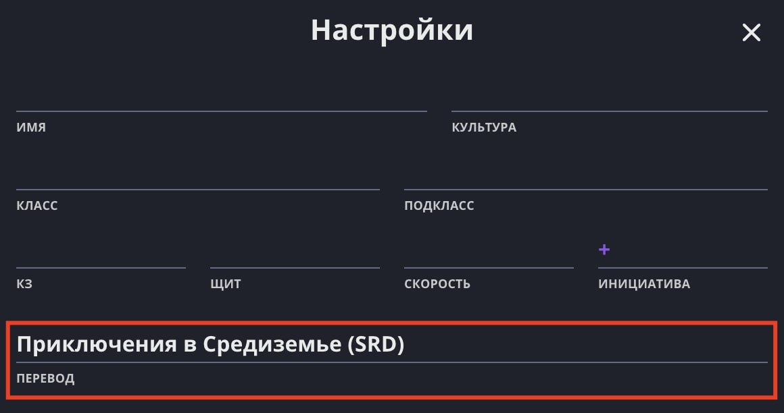

[Лист персонажа Long Story Short](/characters/list/) подходит для «Приключений в Средиземье» — НРИ на основе правил D&D 5e, позволяющей играть в мире Толкина.

## Переключение режима листа персонажа

Зайдите в настройки и в Поле «Перевод» выберите один из двух вариантов для «Приключений в Средиземье»: «SRD» или «Пандора Бокс».

- **SRD**: перевод на основе перевода «Киборгов и Чародеев» для D&D 5e.
- **Пандора Бокс**: официальный перевод «Приключений в Средиземье» в России.

## Отличия от стандартного листа персонажа

1. Добавлены новые и переименованы некоторые навыки:

- Загадка
- Знание
- Знания о Тени
- Традиции

2. Добавлен счётчик Пунктов Тени и спасбросок Соблазна.
3. Добавлены новые и переименованы некоторые поля:

- Слабость перед Тенью
- Образ жизни
- Специализация
- Надежда
- Отчаяние
- Культура
- Подавленность