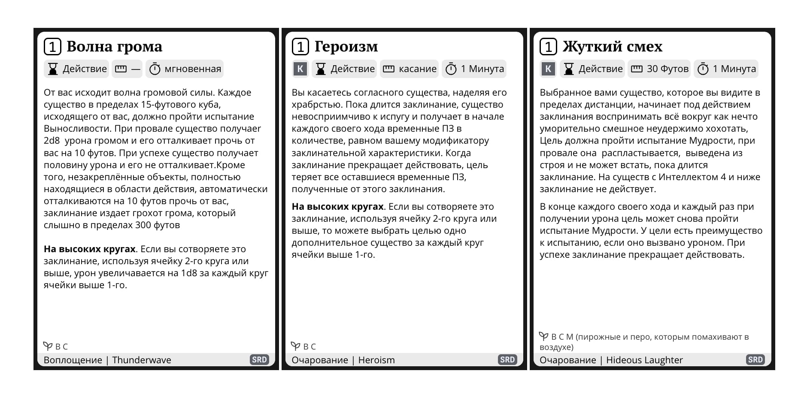

Лист персонажа Long Story Short позволяет отобразить и затем распечатать карточки заклинаний D&D 5e.

Для этого необходимо открыть [классический лист персонажа](/characters/builder/), доскролить до последнего листа и выбрать необходимые заклинания.

Если каких-то заклинаний не хватает, вы можете [добавить собственные](/doc/spells/addition/).

**Преимущества:**

- Удобное расположение на листе, позволяющее быстро разрезать карточки.
- Размер, соответствующий покерным картам и MTG, что позволяет легко проксировать карточки.
- Минималистичный дизайн и дружелюбность к тонеру принтера.
- Перенос длинных заклинаний на несколько карточек.
- Возможность создавать собственные уникальные заклинания.