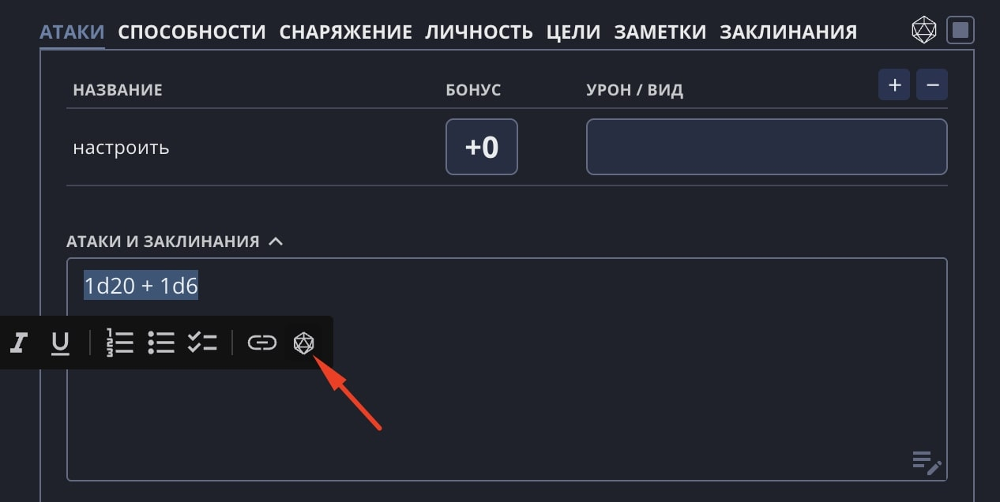
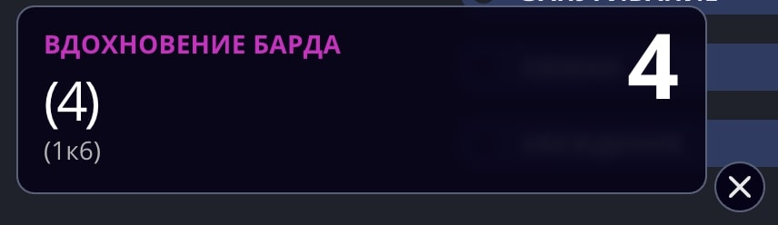
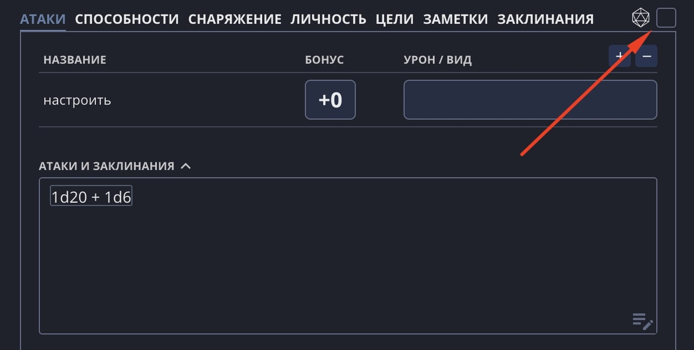

Текстовый редактор поддерживает формулы для бросков.

## Добавление формул

Чтобы превратить текст в формулу, выделите его и нажмите во всплывающем меню иконку с d20 или сочетание клавиш `CTRL + D`.



Формула может иметь произвольное количество костей и граней:

```
1d20
2d6
1d3
```

## Математические операции

Формулы поддерживают следующие математические операторы: `+ - * /`:

```
1d20 + 6
2d6 - 2
1d3 / 2
```

В данный момент нет возможности задать порядок выполнения операций. Кроме того, могут наблюдаться баги при использовании умножения и деления.

## Переменные

В формулу можно вставить переменную, связав её с показателями персонажа:

```
1d20 + [STR]
1d6 + [LVL]
```

Полный список доступных переменных:

| Переменная | Значение |
| --- | --- |
| `[STR]` | Модификатор Силы |
| `[DEX]` | Модификатор Ловкости |
| `[CON]` | Модификатор Телосложения |
| `[INT]` | Модификатор Интеллекта |
| `[WIS]` | Модификатор Мудрости |
| `[CHA]` | Модификатор Харизмы |
| `[PROF]` | Бонус мастерства |
| `[LVL]` | Уровень персонажа |

## Именование броска

Формуле можно задать название, которое высветится при броске. Оно же будет отправлено в Discord, если [создан пресет](/doc/character-sheet/discord/). Название необходимо записывать перед формулой: `Вдохновение барда 1d6`.



## Деактивация формул

Формулы в тексте можно временно отключить, для этого уберите соответствующую галочку рядом с меню.



Это полезно, например, для редактирования формул, чтобы внутрь можно было поставить курсор.

Снятие галочки также отключает ссылки в тексте.
