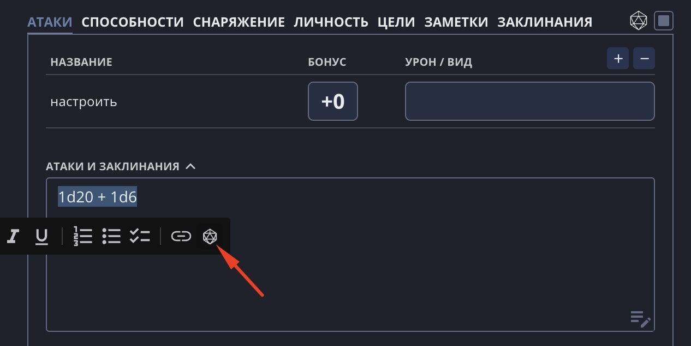
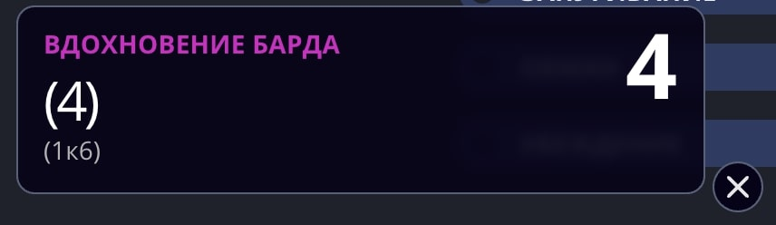
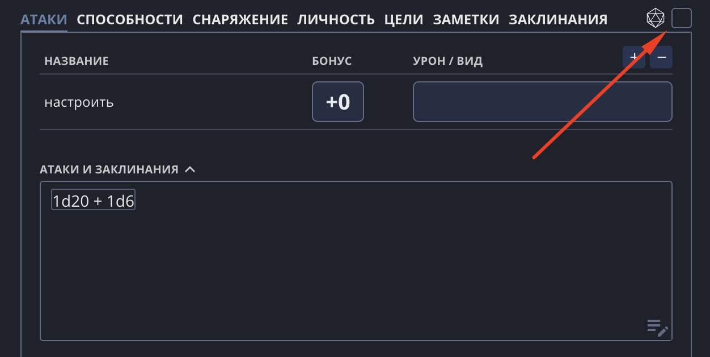

Текстовый редактор поддерживает формулы для бросков.

## Добавление формул

Чтобы превратить текст в формулу, выделите его и нажмите во всплывающем меню иконку с d20 или сочетание клавиш `CTRL + D`.



Формула может быть любой — от `1d20` до `2d20kh1 + [STR]` или `if([LVL] >= 5, 2d8, 1d8)`.
Полный справочник правил записи — [Нотация формул](/doc/character-sheet/notation/).

Формула может иметь произвольное количество костей и граней:

```
1d20
2d6
1d3
```

## Математические операции

Формулы поддерживают математику: `+ - * /`, скобки и функции округления:

```
1d20 + 6
(1d6 + 2) * 2
floor(4d10 / 3)
```

Итог броска округляется вниз.

## Переменные

В формулу можно вставить переменную, связав её с показателями персонажа:

```
1d20 + [STR]
1d6 + [LVL]
```

Полный список доступных переменных:

| Переменная | Значение |
| --- | --- |
| `[STR]` | Модификатор Силы |
| `[DEX]` | Модификатор Ловкости |
| `[CON]` | Модификатор Телосложения |
| `[INT]` | Модификатор Интеллекта |
| `[WIS]` | Модификатор Мудрости |
| `[CHA]` | Модификатор Харизмы |
| `[PROF]` | Бонус мастерства |
| `[HALF_PROF]` | Половина бонуса мастерства, вниз |
| `[LVL]` | Уровень персонажа |

Регистр не важен: `[str]` — то же, что `[STR]`.

## Именование броска

Формуле можно задать название, которое высветится при броске. Оно же будет отправлено в Vortex и мессенджеры. Название записывается перед формулой — `Вдохновение барда 1d6` — или в скобках после неё: `1d20+5 (Атака)`.



## Деактивация формул

Формулы в тексте можно временно отключить, для этого уберите соответствующую галочку рядом с меню.



Это полезно, например, для редактирования формул, чтобы внутрь можно было поставить курсор.

Снятие галочки также отключает ссылки в тексте.
