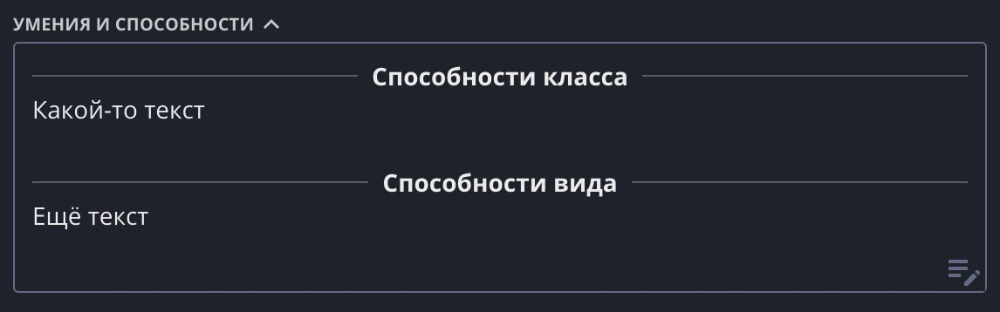
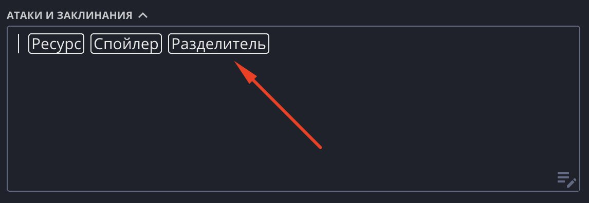

«Разделитель» — тонкая горизонтальная полоска, которая визуально делит текст на части.
Удобно, когда в одном поле собрано несколько разных блоков и хочется отделить их друг от друга. При желании прямо посередине полоски можно написать заголовок.

## Добавление

Чтобы добавить разделитель, поставьте курсор на пустую строку и нажмите появившуюся кнопку «Разделитель».

Есть и быстрый способ: наберите три дефиса `---` на пустой строке — они сразу превратятся в разделитель.

## Заголовок

Нажмите на разделитель — курсор встанет посередине, и можно набрать текст. Полоска раздвинется, и получится «── Заголовок ──». Если стереть текст, разделитель снова
станет сплошной полоской.

## Удаление

Нажмите на пустой разделитель и нажмите Backspace — он удалится. Если в нём есть текст, сначала сотрите текст.

## Классический лист

В классическом листе разделитель занимает ровно одну строку, а полоска проходит по центру клетки — поэтому текст вокруг остаётся ровно в клетках фона и никуда
не съезжает.

## Идеи по использованию

- Отделить блоки способностей друг от друга.
- Разбить длинные заметки на смысловые части.
- Провести черту под важным текстом, чтобы выделить его.
