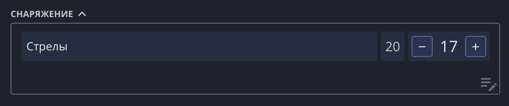
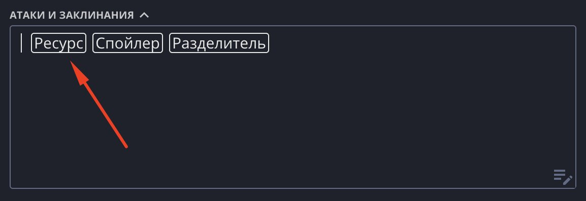
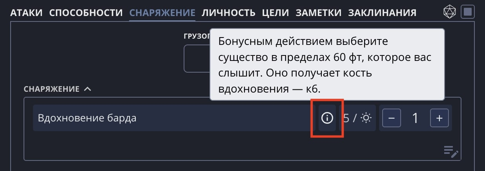

Ресурс это гибкий виджет, для которого можно найти множество применений. В первую очередь для подсчёта неких ресурсов: от стрел до классовых способностей.

## Добавление ресурса

Чтобы добавить Ресурс в текст, поставьте курсор на пустую строку и нажмите на появившуюся кнопку.

## Настройки

В настройках Ресурса имеются следующие поля:

- **Название**: отображаемое название Ресурса.
- **Количество**: текущее количество (не может быть больше максимума).
- **Максимум**: максимальное количество ресурса (можно удалить, если ресурс накапливается бесконечно).
- **Восстановление**: тип отдыха, при котором Ресурс будет автоматически восстановлен до максимума.
- **Заметки**: текстовое описание ресурса.
- **Отображать заметки**: возможность отобразить заметки при наведении/нажатии на иконку i.

## Идеи по использованию

- Потребляемые предметы (стрелы, факелы, наборы целителя).
- Способности (вдохновение барда, божественный канал, Ци).
- Опциональные правила (очки волшебства, очки героизма, очки сюжета, накапливаемые вдохновения).
