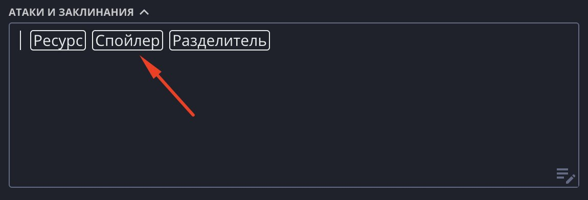

«Спойлер» — сворачиваемый блок с заголовком и содержимым. Помогает сгруппировать
длинный текст под коротким названием и свернуть его, чтобы лист не был перегружен:
описания способностей, черт, заметки мастера, справочные выдержки.

## Добавление

Чтобы добавить блок, поставьте курсор на пустую строку и нажмите появившуюся кнопку
«Спойлер».

## Редактирование

- **Заголовок и содержимое** редактируются по клику — просто нажмите на текст и пишите.
- **Стрелка слева** сворачивает и разворачивает блок. Состояние сохраняется вместе с
  листом.
- **Кнопка удаления** (появляется при наведении) убирает блок целиком.

## Вложенность

Блоки можно вкладывать друг в друга — например, подкласс внутри класса или уровни
внутри способности. Внутрь «Спойлера» можно поместить и [Ресурс](/doc/text-editor/resource/),
чтобы рядом с описанием способности держать её счётчик.

## Печатный лист

На классическом (печатном) листе блок печатается ровно в том виде, в каком вы его
оставили: свёрнутый остаётся свёрнутым. Высота блока подстраивается под клетки фона,
поэтому текст вокруг не съезжает с сетки.

## Идеи по использованию

- Способности класса и подкласса, свёрнутые до названий, — разворачиваете нужную.
- Длинные описания черт и видовых особенностей.
- Справочные выдержки правил.
