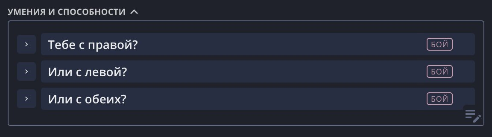

«Спойлер» — сворачиваемый блок с заголовком и содержимым. Помогает сгруппировать
длинный текст под коротким названием и свернуть его, чтобы лист не был перегружен:
описания способностей, черт, заметки мастера, справочные выдержки.

## Добавление

Чтобы добавить блок, поставьте курсор на пустую строку и нажмите появившуюся кнопку
«Спойлер».

## Редактирование

- **Заголовок и содержимое** редактируются по клику — просто нажмите на текст и пишите.
- **Стрелка слева** сворачивает и разворачивает блок. Состояние сохраняется вместе с
  листом.
- **Кнопка удаления** (появляется при наведении) убирает блок целиком.

## Теги

Любому блоку можно поставить свой тег — короткое слово с цветной меткой, по которому
блоки одной темы видно с одного взгляда.

Наведите на блок и нажмите кнопку с ярлычком
рядом с корзиной: введите слово, выберите цвет и подтвердите. Клик по уже стоящему тегу
включит его редактирование, а кнопка с корзиной в этом окошке убирает тег с блока.

Теги, которые вы уже использовали на этом листе, показываются в том же окошке готовыми
метками — нажатие на такую метку ставит и слово, и цвет разом. Так удобнее всего
помечать несколько блоков одним тегом: первый набираете вручную, остальные — в один клик.

**Цвет принадлежит тегу, а не блоку.** Если один и тот же тег стоит на нескольких
блоках и вы перекрасили его на одном, он перекрасится на всех — в том числе в других
текстовых полях листа. А вот переименование так не работает: изменив слово, вы
создаёте новый тег, остальные блоки остаются со старым.

У блоков, которые выдал конструктор создания персонажа, тег стоит автоматически и называет
источник («черта», «класс», «вид»). Такой тег изменить нельзя.

## Вложенность

Блоки можно вкладывать друг в друга — например, подкласс внутри класса или уровни
внутри способности. Внутрь «Спойлера» можно поместить и [Ресурс](/doc/text-editor/resource/),
чтобы рядом с описанием способности держать её счётчик.

## Печатный лист

На классическом (печатном) листе блок печатается ровно в том виде, в каком вы его
оставили: свёрнутый остаётся свёрнутым. Высота блока подстраивается под клетки фона,
поэтому текст вокруг не съезжает с сетки.

## Идеи по использованию

- Способности класса и подкласса, свёрнутые до названий, — разворачиваете нужную.
- Длинные описания черт и видовых особенностей.
- Справочные выдержки правил.
