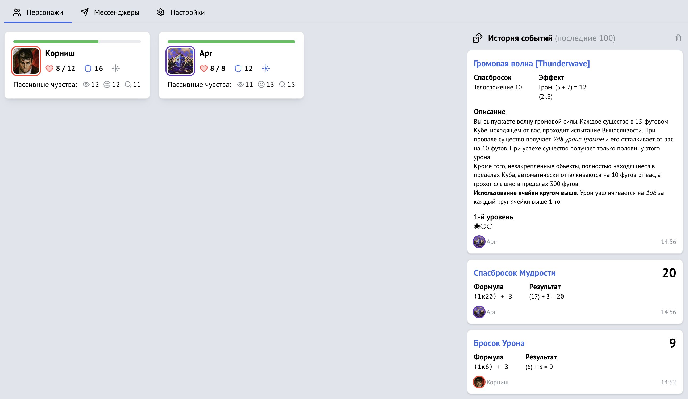

[Vortex](https://vortex.longstoryshort.app/) — это отдельное приложение, которое служит центром управления игровой сессией. Оно объединяет персонажей в одной «комнате» и ведёт общий лог бросков.

## Что умеет Vortex

- **Отображает группу в реальном времени** — мастер видит карточки всех подключённых персонажей с ключевыми характеристиками: здоровье, доспех, навыки и так далее.
- **Ведёт историю событий** — все броски из листов персонажей и сотворение заклинаний появляются в общем журнале мгновенно.
- **Рассылает броски в мессенджеры** — можно настроить отправку событий в [Telegram](/doc/vortex/telegram/) или [Discord](/doc/vortex/discord/) прямо из настроек комнаты.

## Комнаты

Комната — основная единица Vortex. Она соответствует одной игровой группе или кампании.

У каждой комнаты есть уникальный **6-значный код**, который мастер передаёт игрокам. Игроки вводят его в своём листе персонажа, чтобы подключить персонажа к комнате.

## Роли

В Vortex два типа участников:

- **Мастер** — создаёт комнату и управляет её настройками: названием, настройками мессенджеров, историей бросков. Один пользователь может создать до **3 комнат**.
- **Игрок** — подключает своего персонажа к комнате по коду. После подключения его карточка появляется у мастера, а броски из листа персонажа попадают в общий лог.

## Где открыть

Vortex находится по адресу [vortex.longstoryshort.app](https://vortex.longstoryshort.app).

Сейчас в Vortex можно подключать персонажей из интерактивного листа [Long Story Short](https://longstoryshort.app/characters/list/). Позже появится поддержка листов персонажей [Anima](https://anima.longstoryshort.app/).

## Что дальше

Чтобы создать комнату и добавить в неё персонажей, обратитесь к [инструкции](/doc/vortex/adding-characters/).

## Интеграция с Owlbear Rodeo

Комнаты Vortex можно открывать прямо внутри виртуального стола [Owlbear Rodeo](https://www.owlbear.rodeo/). Полное описание и инструкцию по подключению читайте в отдельной статье: [Интеграция с Owlbear Rodeo](/doc/integration/owlbear/).
