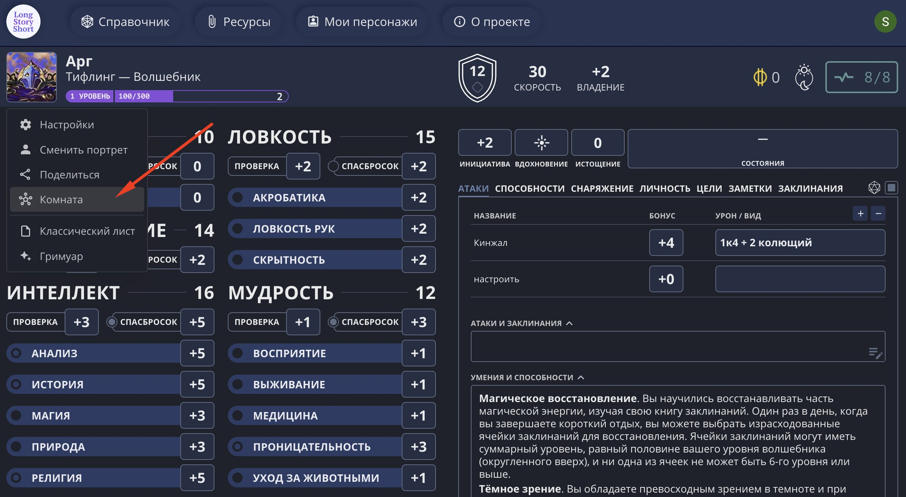
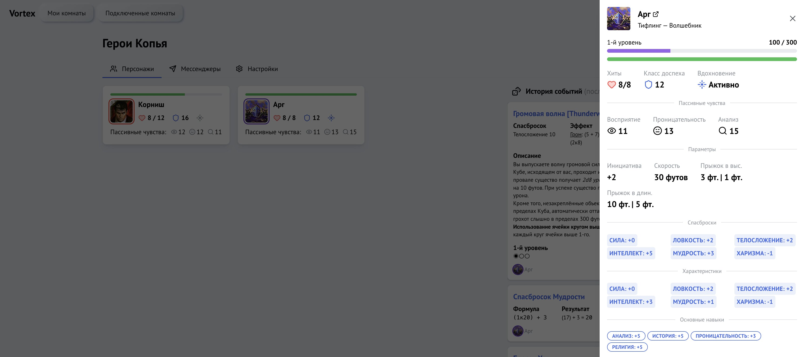

Чтобы персонаж появился в комнате Vortex, мастер сначала создаёт комнату, а игрок подключается к ней из своего листа персонажа.

## Мастеру: создайте комнату

### 1. Создайте комнату

Перейдите на [vortex.longstoryshort.app](https://vortex.longstoryshort.app).

На вкладке «Мои комнаты» нажмите кнопку «Создать комнату» и введите название — например, «Герои Копья».

Один аккаунт может иметь не более **3 активных комнат**.

### 2. Поделитесь кодом

После создания комнаты откройте её — в правом верхнем углу будет отображён **6-значный код**. Передайте его всем игрокам удобным способом.

## Игроку: подключите персонажа

### 1. Откройте меню персонажа

Откройте свой лист персонажа в Long Story Short. Нажмите на аватарку и выберите пункт «Комната».

### 2. Введите код комнаты

Введите 6-значный код, полученный от мастера, и дождитесь подтверждения подключения.

### 3. Выберите цвет

После подключения можно задать **цвет сообщений** — он будет использоваться при отображении ваших бросков в логе и Discord.

### 4. Активируйте отправку

Убедитесь, что рядом с названием комнаты стоит галочка. Без неё броски из листа не будут попадать в Vortex.

Чтобы временно отключить отправку, снимите галочку — это не разрывает подключение.

---

После того как игрок подключился, его персонаж появится в сетке группы на странице комнаты. По клику на карточку можно посмотреть его характеристики.

