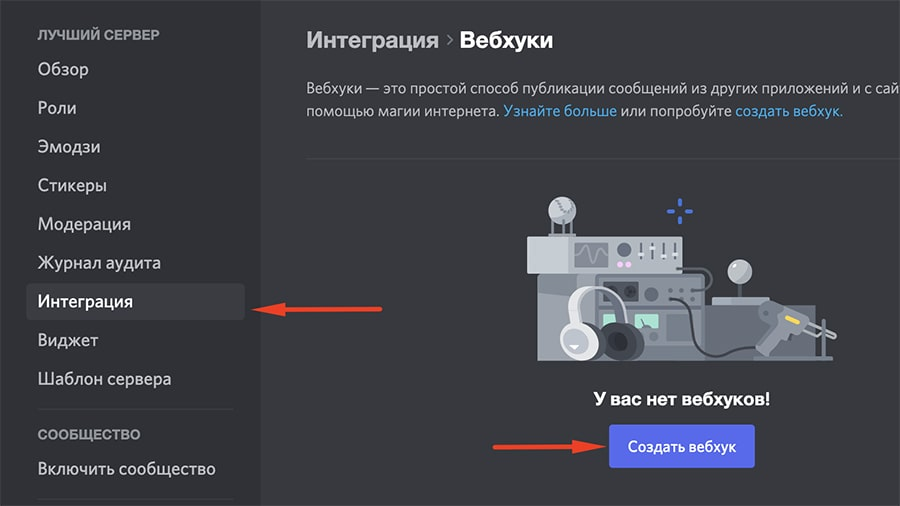
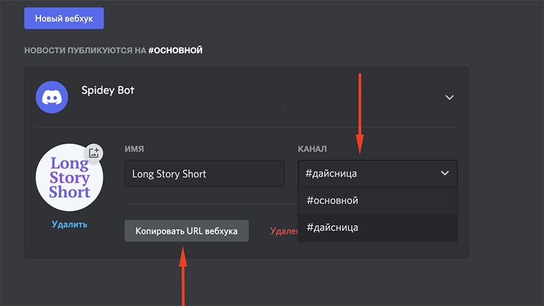
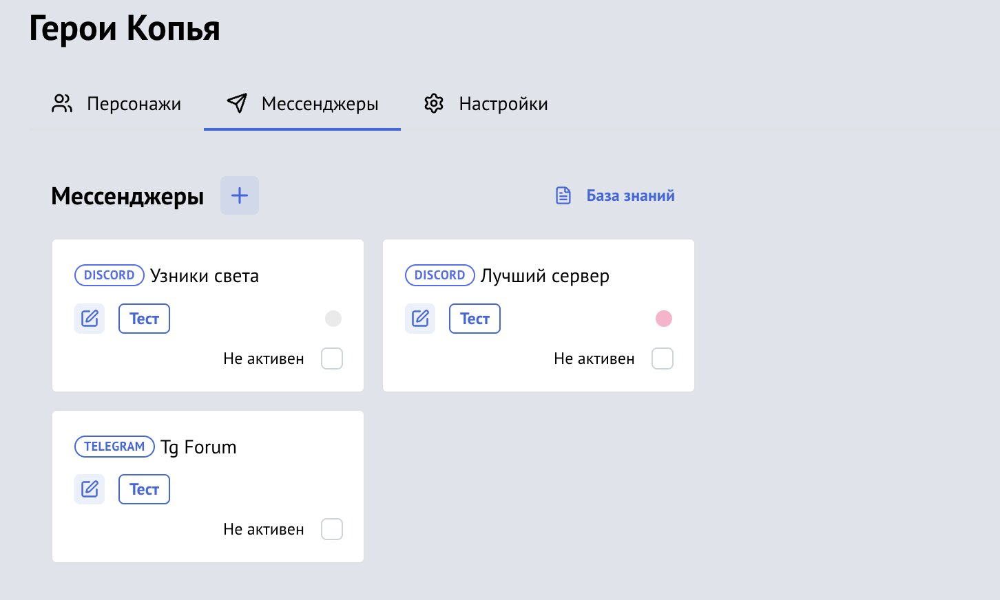
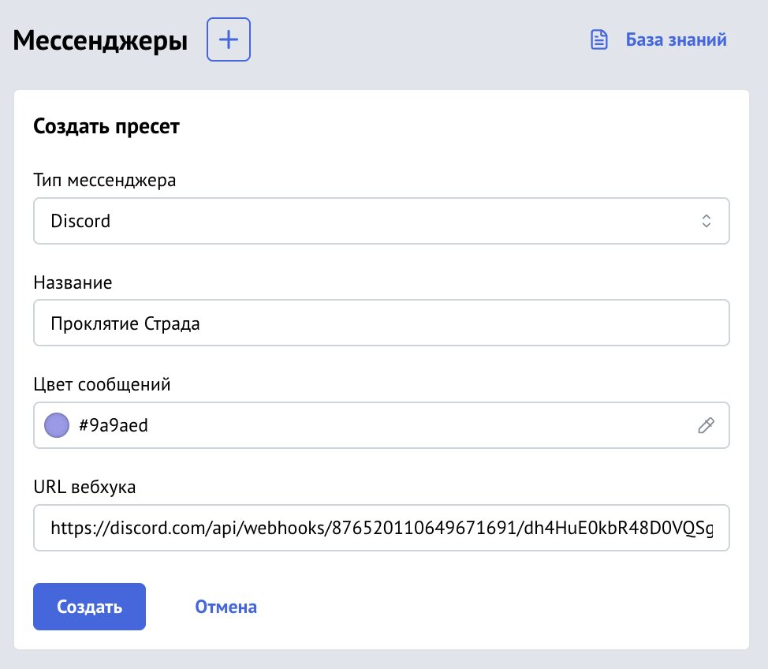
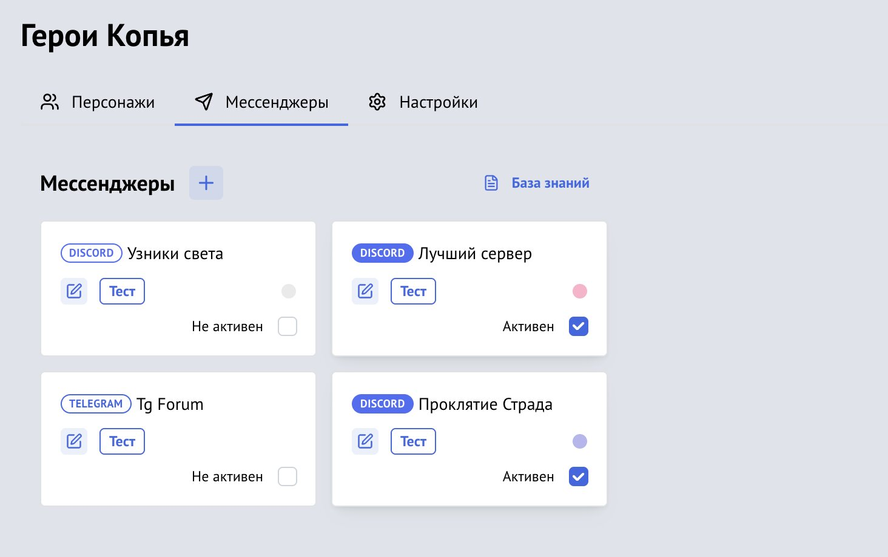

[Vortex](https://vortex.longstoryshort.app/) умеет передавать броски и скастованные заклинания в Discord и [Telegram](/doc/vortex/telegram/).

## 1. Настройте Discord

### 1.1 Сервер Discord

Создайте сервер в Discord, если у вас его ещё нет, и зайдите в его настройки.

### 1.2 Создайте вебхук

В разделе «Интеграция» создайте вебхук. Выберите канал, в который хотите отправлять броски, задайте имя и аватарку боту, который будет присылать броски в чат.

### 1.3 Получите URL вебхука

Скопируйте URL вебхука. Он будет иметь такой вид:

`https://discord.com/api/webhooks/1045914834599747689/pUxaLhP8AOw-4x_FIPFmohWmG1F7X1dwq24OPvccsSSdvcy11bHur0CHcQlmDqOgTKl5`

## 2. Настройте комнату Vortex

О том, как создать комнату и добавить в неё персонажей, [читайте здесь](/doc/vortex/adding-characters/).

### 2.1 Зайдите в настройки мессенджеров

Откройте свою комнату Vortex и зайдите в настройки мессенджеров. Здесь можно создать пресет.

### 2.2 Создайте пресет Discord

Нажмите на + и в появившейся форме выберите тип пресета «Discord». Заполните все поля.

**Название пресета** — будет отображаться только в этих настройках.

**Цвет сообщений** — цвет, которым будут отмечаться сообщения в Discord по умолчанию. Каждый игрок может указать собственный цвет в настроках своего персонажа. Вы можете выбрать из предложенных вариантов или вписать собственный в формате hex.

**URL вебхука** — ссылка, полученная в 1.3 пункте при настройке сервера в Discord.

### 2.3 Проверьте пресет

У созданного пресета имеется кнопка «Тест», с помощью которой можно отправить тестовое сообщение в Discord. Если сообщение не отправилось, проверьте правильность указанного URL вебхука и доступность Discord.

### 2.4 Активируйте пресет

Чтобы начать пересылать сообщения в мессенджер, поставьте галочку в правом нижнем углу пресета. Вы можете активировать сразу несколько пресетов.

