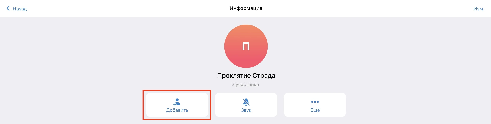
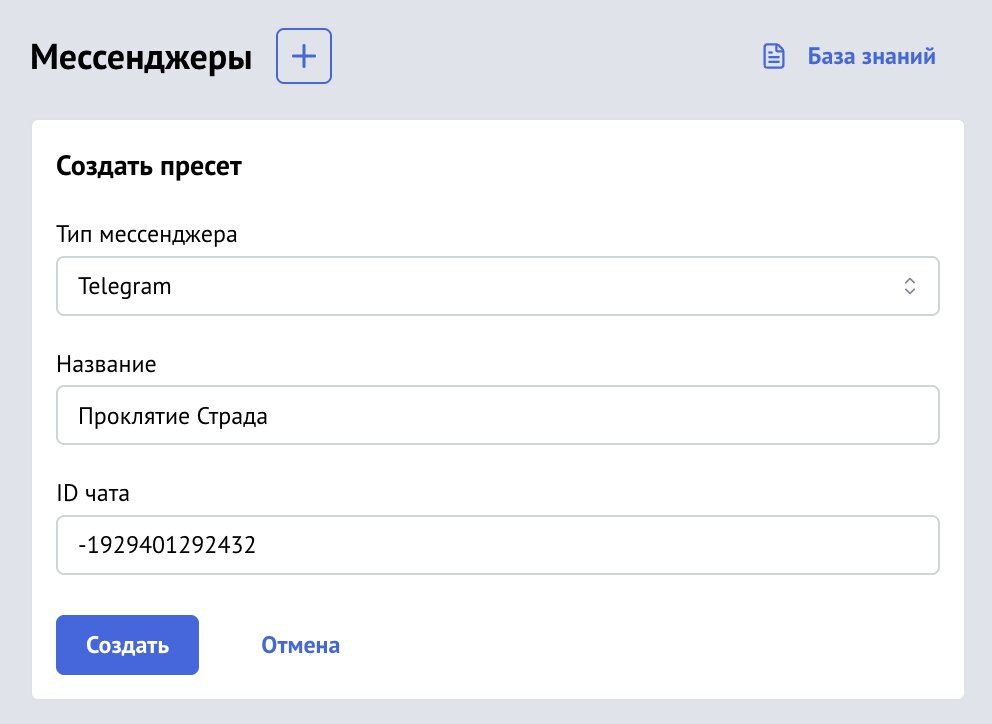
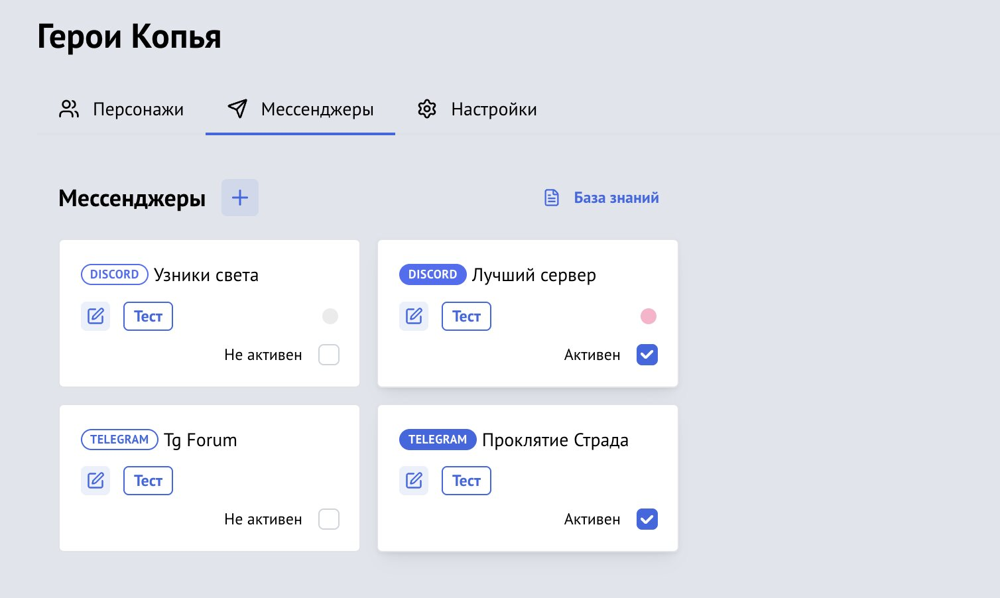

[Vortex](https://vortex.longstoryshort.app/) умеет передавать броски и скастованные заклинания в Telegram и [Discord](/doc/vortex/discord/).

Все действия совершаются владельцем комнаты (у него должно быть право приглашать в Telegram-группу).

## 1. Настройте Telegram

### 1.1 Бот в Telegram

Создайте группу в Telegram, если у вас её ещё нет, и добавьте в неё нашего бота `@lss_app_bot`.

### 1.2 Получите ID чата

Отправьте в группу команду `/start`, и бот в ответ подскажет ID вашего чата. Нажмите на него, чтобы скопировать.

**Обратите внимание**, id часто содержит знак минуса, его тоже необходимо копировать.

## 2. Настройте комнату Vortex

О том, как создать комнату и добавить в неё персонажей, [читайте здесь](/doc/vortex/adding-characters/).

### 2.1 Зайдите в настройки мессенджеров

Откройте свою комнату Vortex и зайдите в настройки мессенджеров. Здесь можно создать пресет.

### 2.2 Создайте пресет Telegram

Нажмите на + и в появившейся форме выберите тип пресета «Telegram». Заполните все поля.

**Название пресета** — будет отображаться только в этих настройках.

**ID чата** — идентификатор, полученный от бота в 1.2 пункте.

### 2.3 Проверьте пресет

У созданного пресета имеется кнопка «Тест», с помощью которой можно отправить тестовое сообщение в Telegram.

Если сообщение не отправляется, проверьте правильность указанного ID чата, права бота в вашей группе и доступность Telegram.

### 2.4 Активируйте пресет

Чтобы начать пересылать сообщения в мессенджер, поставьте галочку в правом нижнем углу пресета. Вы можете активировать сразу несколько пресетов.

